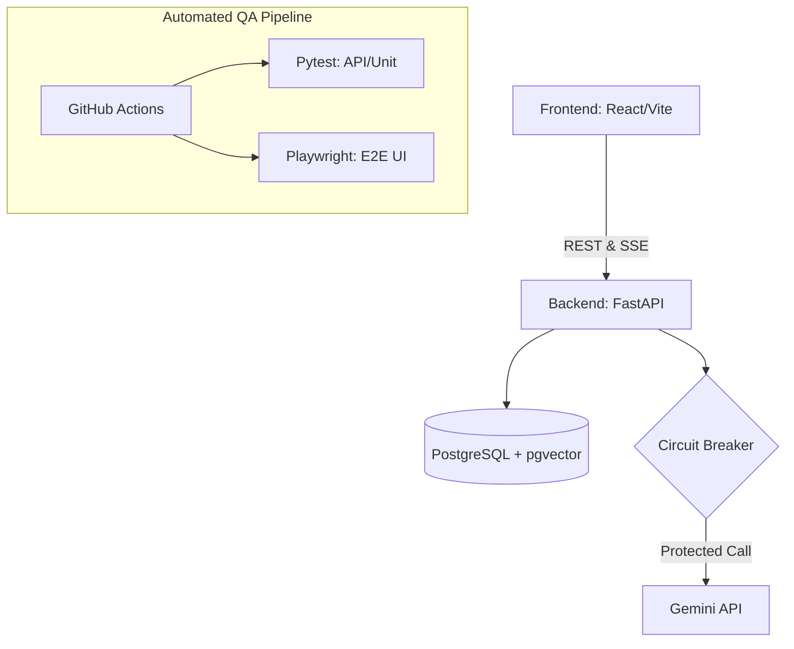

<div align="center">
  <h1>⚖️ AI Legal Intelligence Platform (AILIP)</h1>
  <p><i>An Enterprise-Grade, AI-Powered Legal Search & RAG System with Advanced Data Mining & Comprehensive QA Architecture.</i></p>

  <p>
    <a href="#"></a>
    <a href="#"></a>
    <a href="#"></a>
    <a href="#"></a>
    <a href="#"></a>
    <a href="#"></a>
  </p>
</div>

---

## 📖 Overview
The **AI Legal Intelligence Platform** is not just an application; it is a **production-ready architecture showcase**. Built as a Scientific Research (NCKH) initiative, it processes thousands of Vietnamese legal documents using a **Hybrid Search Pipeline** and a **Retrieval-Augmented Generation (RAG)** engine.

Beyond its core features, this repository serves as a masterclass in **Software Testing (QAOps)**, **Clean Architecture**, and **Data Mining**, proving the capability to build, test, and scale complex AI systems.

> **💡 App Preview:**
> <p align="center">
>   
>   <br>
>   <i>(Thay thế link ảnh trên bằng ảnh screenshot thật của nền tảng)</i>
> </p>

---

## 🎯 Role-Specific Guides

Depending on your area of expertise, please refer to the deep-dive documentation below:

* 🧪 **[QA & Testing Strategy](./docs/TESTING_GUIDE.md)**: Test matrix, E2E Automation, and SLAs.
* 🤖 **[AI/ML Development Guide](./docs/AI_DEVELOPMENT.md)**: RAG Pipeline, anti-hallucination prompts, and mathematical evaluation.
* 📊 **[Business & Analytics Guide](./docs/BUSINESS_GUIDE.md)**: Use cases, dataset overview, KPIs, and Graph Data Mining.
* 🏗️ **[Deployment & Infrastructure](./docs/DEPLOYMENT_GUIDE.md)**: Production checklist, CI/CD, and scaling strategies.

---

## 🔥 Core Competencies & Technical Highlights

### 1. 🛡️ Comprehensive QA Architecture (Test Pyramid)
Quality Assurance is built into the DNA of this project, covering every layer of the Software Development Life Cycle (SDLC):
* **Unit & API Testing:** Built a rigorous `pytest` suite for backend endpoints, utilizing Async Mocking and Database Fixtures (AAA Pattern). **Current Backend Test Coverage: 52%** (Verified via `pytest-cov`).
* **End-to-End (E2E) Testing:** Implemented automated UI testing using **Playwright** (`tests_e2e/`), simulating real-world user interactions.
* **Performance & Load Testing:** Utilized **Locust** (`tests/performance/`) to simulate high-concurrency traffic (100+ concurrent users), successfully identifying and optimizing cryptographic bottlenecks (Bcrypt).
* **AI Evaluation (RAGAs):** Wrote advanced benchmark scripts to mathematically evaluate AI accuracy using `MRR@5`, `Hit@5`, `Faithfulness`, and `Answer Relevancy`.
* **CI/CD Pipeline:** Automated backend testing, frontend builds, and Playwright E2E verification using **GitHub Actions**.

### 2. 🧠 Advanced Data Mining & AI
* **Graph Analytics:** Implemented **PageRank** to identify the most foundational laws and **Louvain Clustering** to group legal documents into legislative communities.
* **Hybrid Vector Search:** Integrated full-text search (BM25) with semantic embeddings using **pgvector** (HNSW Index).
* **Anti-Hallucination RAG:** Engineered a strict prompting mechanism designed to **minimize hallucination risk** by grounding the LLM (Gemini) with precise **inline citations** from retrieved context.

### 3. ⚡ Backend Architecture & Resilience
* **Strict Clean Code:** 3-Tier Architecture (Router - Service - Repository) enforcing the Single Responsibility Principle.
* **Circuit Breaker Pattern:** Engineered a state-machine Circuit Breaker to automatically sever LLM API connections during latency spikes, preventing cascading system failures.
* **Asynchronous Design:** Maximized I/O efficiency using FastAPI's `async/await` and SQLAlchemy's `AsyncSession`. Server-Sent Events (SSE) stream AI responses in real-time.

---

## 🏗️ System Architecture



---

## 📂 Project Structure (Clean Architecture)

```text
├── backend/
│   ├── app/                # Core Application (Routers, Services, DB)
│   ├── data/               # Data dumps and ETL outputs
│   ├── logs/               # Application and Error Logs
│   ├── scripts/            # Standalone Scripts (RAG Benchmarks, ETL)
│   └── tests/              # Pytest Suite & Locust Performance tests
├── docs/                   # System Designs, QA Reports, API Specs
├── frontend/               # React UI
└── tests_e2e/              # Playwright E2E UI Automation
```

---

## 🧪 Running the Test Suite

```bash
# 1. API Integration Tests (Backend)
cd backend
pytest tests/ -v

# 2. Performance Load Testing (Locust)
cd backend
locust -f tests/performance/locustfile.py

# 3. E2E Browser Automation (Frontend)
cd tests_e2e
pytest tests/ -v
```

---

## 🛠️ Local Development Setup

### 1. Requirements
* Docker & Docker Compose (for PostgreSQL/pgvector)
* Node.js 18+
* Python 3.11+

### 2. Quick Start
```bash
# 1. Start Database
docker-compose up -d

# 2. Run the Full Stack (Automated Script)
.\start_dev.ps1
```
* **Frontend:** http://localhost:5173
---

## ⚖️ License & Copyright

**© 2026. All Rights Reserved.**

This project and its source code are **Proprietary**. You may not copy, distribute, modify, or use this source code for any purpose (commercial or academic) without explicit written permission. Refer to the `LICENSE` file for more details.

---
<div align="center">
  <i>Engineered with strict adherence to Clean Code, QA Best Practices, and Modern AI Patterns.</i>
</div>
