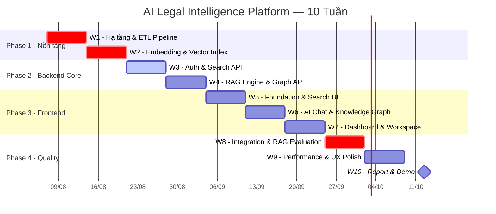
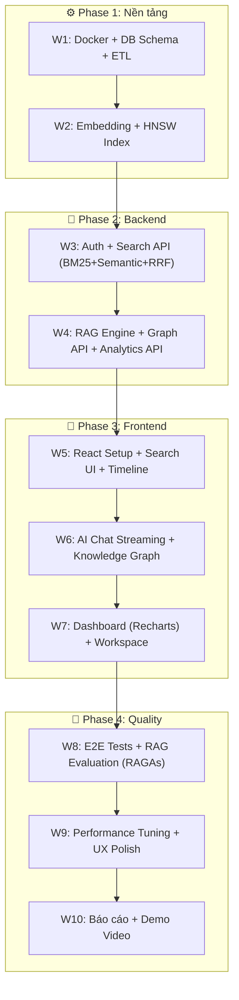

# 🗓️ LỘ TRÌNH THỰC HIỆN CHI TIẾT
## AI Legal Intelligence Platform — 10 Tuần

> **Áp dụng chuẩn business-analysis skill (Antigravity Kit):**
> - 🎨 **Visuals First** — Mermaid diagrams là sự thật, văn bản là giải thích
> - 📋 **User Stories trước, Code sau** — Biết "tại sao" trước khi viết "cái gì"
> - 🔍 **Gap Analysis** — Xác định điểm nghẽn trước mỗi Sprint
> - ✅ **Definition of Done** — Mỗi task phải có tiêu chí hoàn thành rõ ràng

---

## 📊 Tổng quan Gantt



---

## 🗂️ Sơ đồ Dependencies



---

## PHASE 1: NỀN TẢNG (Tuần 1–2)

---

### 📅 TUẦN 1 — Hạ tầng, DB Schema & ETL Pipeline

**Mục tiêu:** Môi trường chạy được, database có dữ liệu thực từ HuggingFace.

#### 🎯 User Stories

| ID | User Story | Priority |
|---|---|---|
| US-1.1 | Là **developer**, tôi muốn `docker-compose up` để có PostgreSQL + pgvector sẵn sàng, không cài tay | 🔴 Must |
| US-1.2 | Là **hệ thống**, tôi muốn DB schema đầy đủ 7 bảng để lưu tất cả thực thể | 🔴 Must |
| US-1.3 | Là **developer**, tôi muốn script ETL chạy một lệnh để tải và chuẩn hóa dữ liệu từ HuggingFace | 🔴 Must |

#### ✅ Definition of Done

- [ ] `docker-compose up` thành công, pgAdmin truy cập tại `localhost:5050`
- [ ] 7 bảng được tạo thành công (`documents`, `document_chunks`, `document_relations`, `users`, `collections`, `notes`, `query_logs`)
- [ ] `SELECT COUNT(*) FROM documents WHERE field='labor'` > 500

#### 📁 Files cần tạo

```
backend/
├── alembic/versions/001_initial_schema.py   🆕
├── app/
│   ├── core/database.py                     🆕 SQLAlchemy engine + session
│   └── models/
│       ├── document.py                      🆕 Document, Chunk, Relation
│       ├── user.py                          🆕 User, Organization
│       └── workspace.py                     🆕 Collection, Note, QueryLog
└── scripts/etl/
    ├── download_data.py                     🆕 Tải từ HuggingFace
    ├── normalize.py                         🆕 Chuẩn hóa schema
    └── load_db.py                           🆕 Insert vào PostgreSQL
```

#### 📋 Breakdown theo ngày

| Ngày | Việc làm | Kiểm tra |
|---|---|---|
| Thứ 2 | Cập nhật `docker-compose.yml`, thêm biến env, chạy thử | `docker-compose up` không lỗi |
| Thứ 3 | SQLAlchemy models: `Document`, `DocumentChunk`, `DocumentRelation` | `from app.models import *` không lỗi |
| Thứ 4 | Models `User`, `Collection`, `Note`, `QueryLog`. Setup Alembic | `alembic revision --autogenerate` sinh file migration |
| Thứ 5 | Chạy migration, kiểm tra 7 bảng | `\dt` trong psql liệt kê đủ 7 bảng |
| Thứ 6 | Viết `download_data.py` tải `th1nhng0/vietnamese-legal-documents` | File Parquet tải về thành công |
| Thứ 7 | Viết `normalize.py` + `load_db.py`, chạy ETL lĩnh vực Lao động | `COUNT(*) FROM documents` > 500 |

---

### 📅 TUẦN 2 — Embedding & HNSW Vector Index

**Mục tiêu:** Toàn bộ chunks được embed, pgvector HNSW index sẵn sàng truy vấn ngữ nghĩa.

#### 🎯 User Stories

| ID | User Story | Priority |
|---|---|---|
| US-2.1 | Là **hệ thống**, tôi muốn mỗi văn bản được cắt thành chunks 256–512 tokens với overlap 50 tokens | 🔴 Must |
| US-2.2 | Là **hệ thống**, tôi muốn mỗi chunk được embed bằng `bkai-foundation-models/vietnamese-bi-encoder` và lưu vào pgvector | 🔴 Must |
| US-2.3 | Là **developer**, tôi muốn HNSW index để query Cosine Similarity nhanh hơn sequential scan | 🔴 Must |

#### ✅ Definition of Done

- [ ] `SELECT COUNT(*) FROM document_chunks WHERE embedding IS NOT NULL` > 5.000
- [ ] Query thử nghiệm Cosine Similarity trả về trong < 500ms
- [ ] HNSW index tồn tại: `\di` hiển thị `idx_chunks_embedding_hnsw`

#### 📁 Files cần tạo

```
backend/scripts/etl/
├── chunker.py       🆕 Sliding window (256-512 tokens, overlap 50)
├── embedder.py      🆕 bkai bi-encoder batch embedding (batch_size=32)
└── build_index.py   🆕 CREATE INDEX HNSW sau khi insert xong
```

#### 📋 Breakdown theo ngày

| Ngày | Việc làm | Kiểm tra |
|---|---|---|
| Thứ 2 | `chunker.py` — cắt text với overlap 50 tokens | Unit test: chunk length + overlap đúng |
| Thứ 3 | `embedder.py` — load bkai model, batch embed | Test: 1 chunk → vector 768D |
| Thứ 4 | Chạy embedding pipeline cho Lao động | `COUNT(*) WHERE embedding IS NOT NULL` > 3.000 |
| Thứ 5 | Chạy ETL Thuế + embedding | `GROUP BY field` ra 2 nhóm (labor, tax) |
| Thứ 6 | `build_index.py` tạo HNSW index | Query test < 500ms |
| Thứ 7 | Test query ngữ nghĩa thủ công | "nghỉ phép năm" → văn bản Lao động đúng |

---

## PHASE 2: BACKEND (Tuần 3–4)

---

### 📅 TUẦN 3 — Auth Module & Search API (BM25 + Hybrid + RRF)

**Mục tiêu:** FastAPI có Auth hoạt động và Search API 3 mode với RRF re-ranking.

#### 🎯 User Stories

| ID | User Story | Priority |
|---|---|---|
| US-3.1 | Là **người dùng**, tôi muốn đăng ký bằng email và nhận JWT token | 🔴 Must |
| US-3.2 | Là **người dùng**, tôi muốn tìm kiếm từ khóa nhận kết quả < 1 giây | 🔴 Must |
| US-3.3 | Là **người dùng đã đăng nhập**, tôi muốn tìm kiếm ngữ nghĩa với RRF re-ranking | 🔴 Must |

#### Acceptance Criteria — US-3.3 (Gherkin)

```gherkin
Feature: Hybrid Search với Reciprocal Rank Fusion

  Scenario: RRF kết hợp BM25 và Semantic rank
    Given người dùng gọi POST /search với mode "hybrid"
    When backend xử lý request
    Then backend tính BM25 rank cho top-20 kết quả
    And backend tính Semantic rank cho top-20 kết quả
    And RRF score = Σ(1 / (60 + rank_i)) cho mỗi doc_id
    And kết quả trả về sắp xếp theo RRF score giảm dần

  Scenario: Semantic Search trả về kết quả đúng ngữ nghĩa
    Given người dùng đã đăng nhập với token hợp lệ
    When gọi POST /search {"query": "nghỉ phép năm bao nhiêu ngày", "mode": "semantic"}
    Then response HTTP 200
    And results[0].content chứa nội dung liên quan đến "phép năm"
```

#### ✅ Definition of Done

- [ ] `POST /auth/register` tạo user, hash Bcrypt
- [ ] `POST /auth/login` trả về `access_token` + `refresh_token`
- [ ] `GET /search?mode=keyword` < 1 giây
- [ ] `POST /search mode=hybrid` áp dụng RRF, kết quả khác mode=keyword
- [ ] Swagger docs đầy đủ tại `/docs`
- [ ] `pytest tests/test_auth.py tests/test_search.py` pass

#### 📁 Files cần tạo

```
backend/app/
├── main.py                         🆕 FastAPI app + CORS + router mount
├── core/
│   ├── config.py                   🆕 Pydantic BaseSettings từ .env
│   ├── security.py                 🆕 JWT encode/decode, Bcrypt
│   └── dependencies.py             🆕 get_current_user dependency
├── routers/
│   ├── auth.py                     🆕 /auth/register, /login, /refresh
│   └── search.py                   🆕 /search (3 modes)
├── services/
│   ├── auth_service.py             🆕 Business logic Auth
│   ├── bm25_service.py             🆕 PostgreSQL tsvector FTS
│   ├── semantic_service.py         🆕 bkai embedding + pgvector query
│   └── rrf_service.py              🆕 Reciprocal Rank Fusion
└── schemas/
    ├── auth.py                     🆕 Request/Response schemas Auth
    └── search.py                   🆕 Request/Response schemas Search
```

#### 📋 Breakdown theo ngày

| Ngày | Việc làm | Kiểm tra |
|---|---|---|
| Thứ 2 | FastAPI app, `.env`, CORS, `/health` endpoint | `GET /health` → `{"status": "ok"}` |
| Thứ 3 | Auth module: register + login + JWT | `POST /auth/login` trả về token |
| Thứ 4 | BM25 Service: PostgreSQL `to_tsvector` + `ts_rank` | Query từ khóa < 1 giây |
| Thứ 5 | Semantic Service: bkai embedding + pgvector HNSW query | Query ngữ nghĩa trả về chunks liên quan |
| Thứ 6 | RRF Service: merge 2 rank lists → unified results | Hybrid khác đơn lẻ |
| Thứ 7 | pytest tests cho cả 3 modes + fix bugs | `pytest tests/test_search.py` pass |

---

### 📅 TUẦN 4 — RAG Engine, Knowledge Graph API & Analytics API

**Mục tiêu:** AI hỏi đáp với streaming + Citations, Graph API + Dashboard API hoạt động.

#### 🎯 User Stories

| ID | User Story | Priority |
|---|---|---|
| US-4.1 | Là **người dùng**, tôi muốn hỏi câu hỏi pháp lý và nhận câu trả lời streaming kèm citations click được | 🔴 Must |
| US-4.2 | Là **hệ thống**, tôi muốn Circuit Breaker tự động fallback nếu LLM timeout > 10 giây | 🔴 Must |
| US-4.3 | Là **người dùng**, tôi muốn xem Knowledge Graph depth=2 của một văn bản | 🔴 Must |
| US-4.4 | Là **người dùng**, tôi muốn Dashboard trả về 5 aggregation metrics | 🟡 Should |

#### Acceptance Criteria — US-4.1 + US-4.2 (Gherkin)

```gherkin
Feature: RAG Pipeline với Anti-Hallucination và Circuit Breaker

  Scenario: AI trả lời câu hỏi có trong dữ liệu
    Given người dùng đã đăng nhập
    When gọi POST /ai/chat {"question": "Thử việc tối đa bao nhiêu ngày?"}
    Then response streaming từng token
    And response cuối chứa "citations" là list không rỗng
    And mỗi citation có "doc_number", "title", "article"

  Scenario: Circuit Breaker fallback khi LLM timeout
    Given LLM API mock timeout 15 giây
    When gọi POST /ai/chat
    Then response trả về trong < 12 giây
    And response.fallback = true
    And response chứa top-5 Semantic Search results thay thế
    And HTTP status vẫn là 200, không phải 500
```

#### ✅ Definition of Done

- [ ] `POST /ai/chat` stream câu trả lời + citations < 5 giây (khi LLM online)
- [ ] LLM timeout > 10s → Circuit Breaker fallback, không trả 500
- [ ] `GET /graph/{doc_id}?depth=2` → `{"nodes": [...], "edges": [...]}` đúng format Vis.js
- [ ] `GET /analytics/dashboard` → 5 metrics đúng kiểu dữ liệu
- [ ] `pytest tests/test_rag.py tests/test_graph.py` pass

#### 📁 Files cần tạo

```
backend/app/
├── routers/
│   ├── ai.py           🆕 POST /ai/chat (streaming), POST /ai/summarize
│   ├── graph.py        🆕 GET /graph/{doc_id}
│   └── analytics.py    🆕 GET /analytics/dashboard
└── services/
    ├── rag_service.py          🆕 LangChain: Retrieve→RRF→Augment→Generate
    ├── circuit_breaker.py      🆕 Timeout + Fallback logic
    ├── graph_service.py        🆕 Build nodes/edges từ DocumentRelation
    └── analytics_service.py    🆕 Aggregation queries
```

#### 📋 Breakdown theo ngày

| Ngày | Việc làm | Kiểm tra |
|---|---|---|
| Thứ 2 | RAG: Retrieve (Top-20) + RRF Rerank (Top-5) | Unit test: rerank đúng thứ tự |
| Thứ 3 | RAG: Augment (System Prompt) + Generate (Gemini API) | Gemini trả về câu trả lời có citations |
| Thứ 4 | Streaming endpoint + Circuit Breaker fallback | Mock Gemini timeout → fallback < 12s |
| Thứ 5 | Knowledge Graph Service + API `/graph/{doc_id}` | Doc có quan hệ → nodes/edges đúng |
| Thứ 6 | Analytics Service + API `/analytics/dashboard` | 5 metrics đúng kiểu dữ liệu |
| Thứ 7 | pytest toàn bộ Phase 2, integration test RAG pipeline | `pytest tests/` pass tất cả |

---

## PHASE 3: FRONTEND (Tuần 5–7)

---

### 📅 TUẦN 5 — Foundation, Search UI & Timeline

**Mục tiêu:** Giao diện tìm kiếm hoạt động end-to-end với Backend, Timeline văn bản hiển thị đúng.

#### 🎯 User Stories

| ID | User Story | Priority |
|---|---|---|
| US-5.1 | Là **người dùng**, tôi muốn Search Bar nổi bật với toggle Keyword / Smart Search | 🔴 Must |
| US-5.2 | Là **người dùng**, tôi muốn thấy Skeleton UI trong khi chờ kết quả | 🔴 Must |
| US-5.3 | Là **người dùng**, tôi muốn mở trang chi tiết văn bản với toàn văn và Timeline lịch sử | 🔴 Must |
| US-5.4 | Là **người dùng**, tôi muốn đăng nhập/đăng ký, trạng thái auth giữ qua refresh | 🟡 Should |

#### ✅ Definition of Done

- [ ] `npm run dev` không lỗi TypeScript
- [ ] Search Bar toggle Keyword / Smart Search
- [ ] Skeleton UI khi loading, cards render đúng
- [ ] Click kết quả → mở đúng trang chi tiết văn bản
- [ ] Timeline ≥ 1 mốc thời gian cho văn bản có lịch sử
- [ ] Login/Register hoạt động, JWT lưu `localStorage`

#### 📁 Files cần tạo

```
frontend/src/
├── components/search/
│   ├── SearchBar.tsx        🆕 Input + mode toggle + submit
│   ├── SearchResults.tsx    🆕 List + Skeleton UI
│   └── ResultCard.tsx       🆕 Card 1 kết quả
├── components/document/
│   ├── DocumentDetail.tsx   🆕 Trang chi tiết
│   └── Timeline.tsx         🆕 Vertical timeline mốc sửa đổi
├── components/auth/
│   ├── LoginForm.tsx        🆕
│   └── RegisterForm.tsx     🆕
├── hooks/
│   ├── useSearch.ts         🆕 Custom hook gọi Search API
│   └── useAuth.ts           🆕 Auth state management
├── services/api.ts          🆕 Axios instance + interceptors
└── pages/
    ├── SearchPage.tsx       🆕
    └── DocumentPage.tsx     🆕
```

#### 📋 Breakdown theo ngày

| Ngày | Việc làm | Kiểm tra |
|---|---|---|
| Thứ 2 | `npm create vite@latest . --template react-ts`, cài deps, proxy config | `npm run dev` chạy localhost:5173 |
| Thứ 3 | `SearchBar.tsx` + `useSearch.ts` + kết nối Search API | Gõ từ khóa → gọi Backend → nhận kết quả |
| Thứ 4 | `ResultCard.tsx` + `SearchResults.tsx` + Skeleton UI | Skeleton khi loading, cards render đúng |
| Thứ 5 | `DocumentDetail.tsx` — toàn văn + metadata | Click kết quả → mở đúng trang |
| Thứ 6 | `Timeline.tsx` — vertical với màu sắc theo loại sự kiện | Timeline render văn bản có sửa đổi |
| Thứ 7 | `LoginForm.tsx` + `RegisterForm.tsx` + `useAuth.ts` | Đăng nhập thành công, token lưu |

---

### 📅 TUẦN 6 — AI Chat (Streaming) & Knowledge Graph (Vis.js)

**Mục tiêu:** AI Assistant stream realtime, Knowledge Graph tương tác hoàn chỉnh.

#### 🎯 User Stories

| ID | User Story | Priority |
|---|---|---|
| US-6.1 | Là **người dùng**, tôi muốn thấy câu trả lời AI xuất hiện từng từ (streaming) | 🔴 Must |
| US-6.2 | Là **người dùng**, tôi muốn Citations cuối câu trả lời click được, mở văn bản nguồn | 🔴 Must |
| US-6.3 | Là **người dùng**, tôi muốn mở Knowledge Graph từ trang văn bản, thấy nodes/edges đủ màu sắc | 🔴 Must |
| US-6.4 | Là **người dùng**, tôi muốn hover vào node xem tóm tắt, double-click để điều hướng | 🟡 Should |

#### ✅ Definition of Done

- [ ] Chat stream từng token (EventSource), chữ xuất hiện realtime
- [ ] Citations list cuối câu trả lời, click được, điều hướng đúng
- [ ] LLM fallback: thông báo thân thiện + kết quả Semantic Search hiển thị
- [ ] Knowledge Graph màu edge theo loại quan hệ (Hướng dẫn=Xanh, Sửa đổi=Cam, Thay thế=Tím, Bãi bỏ=Đỏ)
- [ ] Hover node → Tooltip thông tin, double-click → `/document/{id}`

#### 📋 Breakdown theo ngày

| Ngày | Việc làm | Kiểm tra |
|---|---|---|
| Thứ 2 | `AIChatInterface.tsx` — layout chat, input, message list | UI render, không có API |
| Thứ 3 | `useAIChat.ts` — EventSource streaming `/ai/chat` | Mỗi token append vào message |
| Thứ 4 | `CitationList.tsx` — parse + render links citations | Click → mở đúng `/document/{id}` |
| Thứ 5 | `KnowledgeGraph.tsx` — init Vis.js Network với nodes/edges từ API | Graph render, không lỗi |
| Thứ 6 | Màu sắc edges + Tooltip hover node | Hover → popup thông tin văn bản |
| Thứ 7 | Double-click điều hướng + Integration test full flow | Search → Detail → Graph → Detail |

---

### 📅 TUẦN 7 — Dashboard (Recharts) & Workspace

**Mục tiêu:** Dashboard 5 biểu đồ reactive, Workspace cá nhân lưu văn bản.

#### 🎯 User Stories

| ID | User Story | Priority |
|---|---|---|
| US-7.1 | Là **người dùng**, tôi muốn Dashboard với 5 biểu đồ cập nhật đồng loạt khi đổi filter | 🔴 Must |
| US-7.2 | Là **người dùng đã đăng nhập**, tôi muốn bookmark văn bản vào Collection | 🔴 Must |
| US-7.3 | Là **người dùng đã đăng nhập**, tôi muốn thêm ghi chú cá nhân vào văn bản | 🟡 Should |

#### ✅ Definition of Done

- [ ] 5 biểu đồ Recharts: Line Chart, Pie Chart, Bar Chart, Heatmap Calendar, KPI Cards
- [ ] Filter thay đổi → tất cả biểu đồ cập nhật đồng loạt
- [ ] Nút Bookmark trên trang Detail — toggle lưu/bỏ lưu
- [ ] Trang Workspace liệt kê Collection và văn bản đã bookmark
- [ ] Form thêm/sửa/xóa ghi chú hoạt động

---

## PHASE 4: QUALITY & POLISH (Tuần 8–10)

---

### 📅 TUẦN 8 — Integration Tests & RAG Evaluation

**Mục tiêu:** Đo chất lượng RAG bằng số liệu cụ thể, E2E test pass.

#### 📊 RAG Evaluation Targets (RAGAs Framework)

| Metric | Đo gì | Mục tiêu | Dataset |
|---|---|---|---|
| **MRR@5** | Vị trí trung bình của kết quả đúng trong Top-5 | ≥ 0.70 | thangvip/vietnamese-legal-qa |
| **Hit@5** | % câu hỏi có ≥ 1 chunk đúng trong Top-5 | ≥ 0.85 | thangvip/vietnamese-legal-qa |
| **Faithfulness** | AI có bịa thêm ngoài Context không? | ≥ 0.90 | Sample 100 câu hỏi |
| **Answer Relevancy** | Câu trả lời đúng trọng tâm không? | ≥ 0.85 | Sample 100 câu hỏi |

#### ✅ Definition of Done

- [ ] Script `evaluate_rag.py` chạy tự động, xuất `evaluation_report.json`
- [ ] MRR@5 ≥ 0.70 (nếu chưa đạt: điều chỉnh chunk size, overlap, top-K)
- [ ] `pytest tests/e2e/` pass 3 kịch bản: HR, CEO, Legal

#### 📋 3 Kịch bản E2E bắt buộc

| # | Kịch bản | Actor | Thao tác | Kết quả mong đợi |
|---|---|---|---|---|
| 1 | HR scenario | Nhân viên HR | Hỏi "Thử việc tối đa bao nhiêu ngày?" → xem Timeline Bộ Luật Lao động | Semantic Search đúng điều khoản. Timeline có mốc 2012 → 2019 |
| 2 | CEO scenario | Chủ SME | Hỏi AI "Làm thêm giờ cuối tuần trả lương thế nào?" → click Citation | AI trả lời đúng hệ số lương, Citation click → mở đúng văn bản nguồn |
| 3 | Legal scenario | Pháp chế | Mở Knowledge Graph Nghị định Lao động nước ngoài → double-click Thông tư | Graph đúng nodes/edges, double-click → trang chi tiết Thông tư |

---

### 📅 TUẦN 9 — Performance Tuning & UX Polish

**Mục tiêu:** API và UI đạt benchmark hiệu năng, responsive mọi thiết bị.

#### Performance Benchmarks bắt buộc

| Endpoint | Mục tiêu | Công cụ đo |
|---|---|---|
| `GET /search?mode=keyword` | < 1 giây | pytest + httpx |
| `POST /search?mode=hybrid` | < 2 giây | pytest + httpx |
| `POST /ai/chat` (first token) | < 3 giây | Browser DevTools |
| `GET /graph/{id}` | < 2 giây | pytest + httpx |
| Frontend LCP | < 2.5 giây | Lighthouse |

#### ✅ Definition of Done

- [ ] Tất cả benchmarks đạt ngưỡng
- [ ] Lighthouse score ≥ 80 (Performance + Accessibility)
- [ ] Responsive đúng trên Mobile (375px), Tablet (768px), Desktop (1440px)
- [ ] Skeleton UI đúng lúc cho tất cả components có data fetching

---

### 📅 TUẦN 10 — Báo cáo & Demo

**Mục tiêu:** Sản phẩm hoàn chỉnh, tài liệu sẵn sàng nộp, Demo video chuyên nghiệp.

#### ✅ Checklist Hoàn thành

**Tài liệu:**
- [ ] Báo cáo NCKH hoàn chỉnh tất cả chương (theo template trường)
- [ ] Slide thuyết trình ≤ 15 slides
- [ ] `README.md` hướng dẫn cài đặt và chạy bằng `docker-compose up`

**Kỹ thuật:**
- [ ] `docker-compose up` chạy toàn hệ thống, không cài thêm gì
- [ ] `.env.example` đầy đủ biến (không có secret thật)
- [ ] `evaluation_report.json` đính kèm kết quả RAG

**Demo:**
- [ ] Video demo ≥ 5 phút: 3 kịch bản HR, CEO, Legal
- [ ] Deploy hoặc chạy local bằng Docker

---

## 🔍 Gap Analysis & Risk Register

| Rủi ro | Xác suất | Tác động | Giải pháp |
|---|---|---|---|
| **AI Hallucination** | Thấp | Rất cao | System Prompt bắt buộc + Citations luôn hiển thị |
| **LLM API Rate Limit** | Cao | Cao | Circuit Breaker + Cache + Fallback Semantic Search |
| **Thiếu thời gian W10** | TB | Cao | UC-18, UC-19 là Roadmap — cắt bỏ nếu cần |
| **Embedding chậm** | TB | TB | Batch size 32, chạy ngoài giờ qua đêm |
| **Vis.js chậm với graph lớn** | Thấp | TB | Giới hạn depth=2, max 150 nodes |
| **HNSW build time lâu** | Thấp | Thấp | Build sau khi insert xong, 1 lần duy nhất |

---

## 🚀 Lệnh Bắt đầu Ngay Hôm Nay (Tuần 1, Thứ 2)

```bash
# 1. Khởi động Docker
cd D:\NCKH
docker-compose up -d

# 2. Tạo virtual env Backend
cd D:\NCKH\backend
python -m venv venv
venv\Scripts\activate
pip install fastapi uvicorn sqlalchemy alembic psycopg2-binary pgvector `
            python-jose[cryptography] bcrypt pydantic-settings langchain `
            langchain-google-genai sentence-transformers datasets

# 3. Init Alembic
alembic init alembic
# Sau đó: viết models → alembic revision --autogenerate → alembic upgrade head

# 4. Tạo Frontend (Tuần 5)
cd D:\NCKH
npm create vite@latest frontend -- --template react-ts
cd frontend
npm install axios react-router-dom zustand @tanstack/react-query `
            vis-network recharts
```

---

> **Cấu trúc dự án cuối** (theo docs/ standard của business-analysis skill):
> Tất cả tài liệu kỹ thuật lưu tại `D:\NCKH\docs\` — bao gồm `PhanTichHeThong_v2_Fixed.docx`, `evaluation_report.json`, và các User Story templates.
